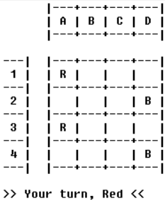
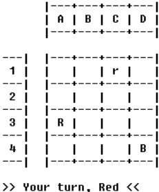
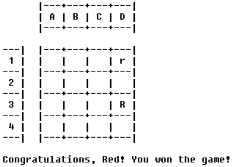
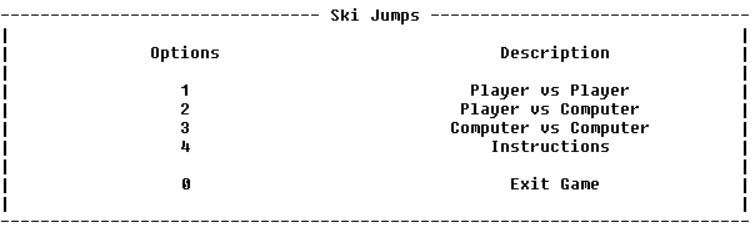
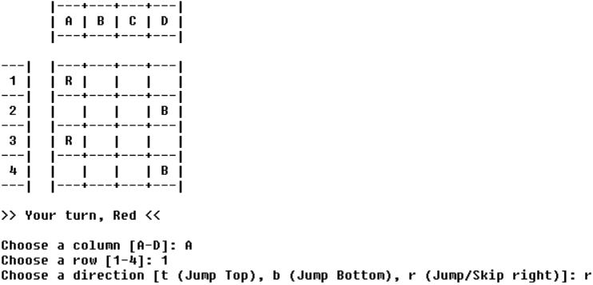

# SkiJumps_2

## Group Identification 

**Group** T12_SkiJumps_2

João Pedro Reis Teixeira - up202005437 (50%)
Rui Pedro Rosas Soares - up202103631 (50%)


## Installation and Execution

To play the game you first need to have SICStus Prolog 4.7 or a newer version currently installed in your machine plus the folder with the source code. 

Next, on the SICStus interpreter, consult the file *play.pl* located in the source root directory:

    ?- consult('./play.pl').

If you're using Windows, you can also do this by selecting `File` -> `Consult...` and selecting the file `play.pl`.
    
Finally, run the the predicate play/0 to enter the game main menu: 

    ?- play.

The game is best enjoyed by selecting a bold and impactful font into SicStus' terminal.

## Game Description
### Board

The board is an NxM rectangular board, where N/M are an odd number between 2 and 20. There are Red/Black pieces facing each other on each board edge.

The game is more enjoyable in a 10x10 board.

### Gameplay
Red/Black pieces can move 1 cell to the right/left, respectively, each time they are selected. 
Jumper Pieces can also jump over an enemy piece directly below or above them. 
If the jumped piece is a Jumper, it is demoted to a Slipper. 
**But be careful!** If you jump over the edge the Jumper Piece is removed! 
When a piece moves off the board, it is removed.

The winner is the player able to make the last move. Therefore the game ends with only 1 piece remaining on the board. **Wins the player that owns that piece.**


## Game Logic
### Game State Internal Representation

The **game state** is composed of the **current state for the board** and the **colour of the current player**.

The first color is chosen at **random**. In the examples, we will always assume the Red player plays first.

- The **Board** is represented by a **list of lists**: each list is a line on the board and each element in the list is a board cell. 

- A **Cell** is represented by its **State**:
    - **rJ** for a Cell containing a Red Jumper, 
    - **rS** for a Cell containing a Red Slipper,
    - **bJ** for a Cell containing a Black Jumper,
    - **bS** for a Cell containing a Black Slipper,
    - **e** for an Empty Cell.

- The **Color** of the **current player** is an atom which takes the value of **r** if Red is playing or **b** is Black is playing.


#### Initial State (4x4)

```
[
[rJ, e, e, e],
[e, e, e, bJ],
[rJ, e, e, e],
[e, e, e, bJ],
],r
```




#### Intermediate State (4x4)

```
[
[e, e, rS, e],
[e, e, e, e],
[rJ, e, e, e],
[e, e, e, bJ],
],r
```



#### Final State (4x4)

```
[
[e, e, e, rS],
[e, e, e, e],
[e, e, e, rJ],
[e, e, e, e],
],r
```




### Game State Visualization

The predicates for the game visualization are separated into two different modules: `menu` and `game`, representing the menu and game state's interaction and display:

- The `menu` module has a few helper predicates meant to reutilize the code and ease the creation of new menu sections ( *menu_io.pl* ), e.g., **menuTitle/1** and **menuOptionsHeader/2**. The main menu predicates are created using those, like **mainMenu/0** and **chooseDifficulty/2** ( *menu.pl* ).



- Likewise, the `game` module has helper predicates used for interaction ( *game_io.pl* ), for example, **readUntilValidRow/2** and **askTypeOfMove/2**. These are used by the main predicates in *game.pl*, like **gameLoop/3** and **chooseMove/3**. All the user interactions are validated (either in the I/O or move execution predicates) and inform the players of possible errors before asking for another input.
- The game has a flexible NxM board, which must be an even number between 2 and 20, dictated by the rules. The initial game state can be obtained with the predicate **initialState/2**:

        initialState(+Size, -GameState)

    Note: The first player is chosen randomly

- The game board is displayed to the user by the predicate **displayGame/1**:

        displayGame(+GameState)

    It uses other support predicates like **displayColumns/1**, which displays the columns header, and **boardLine/3**, whichs prints a line of the board. Other important predicates for displaying the game include **displayBotMove/2**, which informs the user of the computer's move, and **printPlayerTurn/1**, which notifies the player of his turn.



### Move Execution

The strategy for validating and applying a move was to create the predicate **move/3**:

    move(+GameState, +Move, -NewGameState)

The predicate will fail if the given move is not valid.

The predicate validates the move with **validateShiftStone/3**, and it applies the move with **shiftStone/4**.

- The main helper predicates for this are:
    - **getCell/4** to acquire the Cell on the Selected Position,
    - **state/2** to check if the selected Cell belongs to the player,
    - **enemyState/2** to check, when jumping, if the Cell above or below is owned by the enemy player,
    - **replaceCell/5** to apply a change to the board.
    
### Game Over

The strategy for checking if the game ended was to create the predicate **gameOver/2**:

    gameOver(+GameState, -Winner)

The predicate will succeed if the game has ended.

The predicate will traverse the board and check for the existence of player cells. When the 1st Player Cell is found, it stops execution and returns failure, meaning the game is not over. If no Player Cells are found, it returns success, and thus the game ends.

### List of Valid Moves:

The first step for the creation of the bot was to create the predicate **validMoves/2**:
    
    validMoves(+GameState, -Moves)

Using **setof/3** and **findMoves/3** we are able to find all valid moves a player can make on a given turn.

### Game State Evaluation

The strategy for evaluating the game board was to create the predicate **evaluateBoard/2**:

    evaluateBoard(+State, -Value)

The approach of this predicate tries to model the question: *How many Jumpers and Slippers will I keep, and how many will my opponent keep?* If we have a Jumper Piece over/below any opponent's piece, probably the best course of action is to try and jump over that piece, making it a Slipper and delaying our piece arrival to the end of the board. Otherwise, the best plan is to keep advancing our own pieces. The code flows like so:

- Calculate, for each player, immediate values based solely on their pieces. 
The first value corresponds to the sum of Jumper Pieces plus double the Slipper Pieces (it's worse to have Slippers).
The second value corresponds to the sum of enemy Slipper Pieces plus double the Jumper Pieces (it's worse to let them have Jumpers).
- Then, the **overallValue/3** predicate takes those two intermediate results and calculates the final value. If the player's value is 0, it means he already won (best outcome). Otherwise, we have two distinct scenarios:
    - Your piece falls off the board: this is the worst outcome, since you want to keep the most pieces on the board for the longest possible plays. This is therefore the lowest value play, and the highest cost play.

    - The opponent keeps all his Jumper Pieces: this is a bad (but not worse) outcome, since the opponent will have more move versatility if the player doesn't jump over his Jumper Pieces. Hence, a low value play for the player, but a high cost play.

    - The opponent loses 1 Jumper Piece: this is a good outcome, since the opponent will lose move versatility (Slippers can only move sideways). In this case its a high value play, then a low cost play.

    - No player loses nor wins anything: this is a neutral outcome, since nothin really happens, no one loses nor wins anything with the next play. Its a neutral value and cost play.

### Computer Move

The strategy for deciding the computer moves was to create the predicate **chooseMove/3**:

    chooseMove(+GameState, +PlayerType, -Move)

This predicate uses **validMoves/2** to get the list of possible moves and then chooses one based on the bot's level:

- **Easy**: Chooses a random move, using *random_select/3*.
- **Hard**: Chooses the best current move (greedy algorithm), based on the board's evaluation (recall **evaluateBoard/2**). For that purpose, uses *setof/3* to get the list of possible moves ordered by value and chooses the smallest one.

## Conclusion

The board game **Ski Jumps** was successfully implemented in the SicStus Prolog 4.7 language. The game can be played Player vs Player, Player vs Computer or Computer vs Computer (with the same or different levels).

One of the difficulties of the project was moving the pieces off the board. It was necessary to check if the values inserted were numbers. We still had some problems, which we couldn't identify, but somehow we managed to fix it, using different approaches.

Another limitation of the game is the hard bot's algorithm, which only looks at an immediate play, greatly reducing its cleverness. A possible improvement would be to implement another level with a better algorithm, for example, [minimax](https://pt.wikipedia.org/wiki/Minimax).

### Sources
- https://www.di.fc.ul.pt/~jpn/gv/skijump.htm